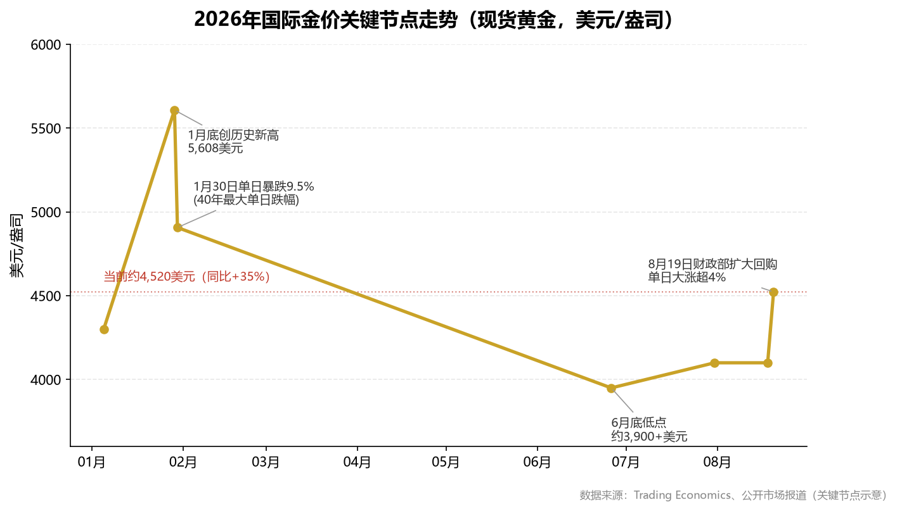
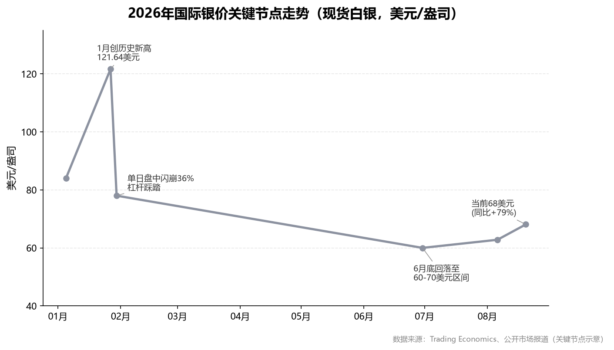
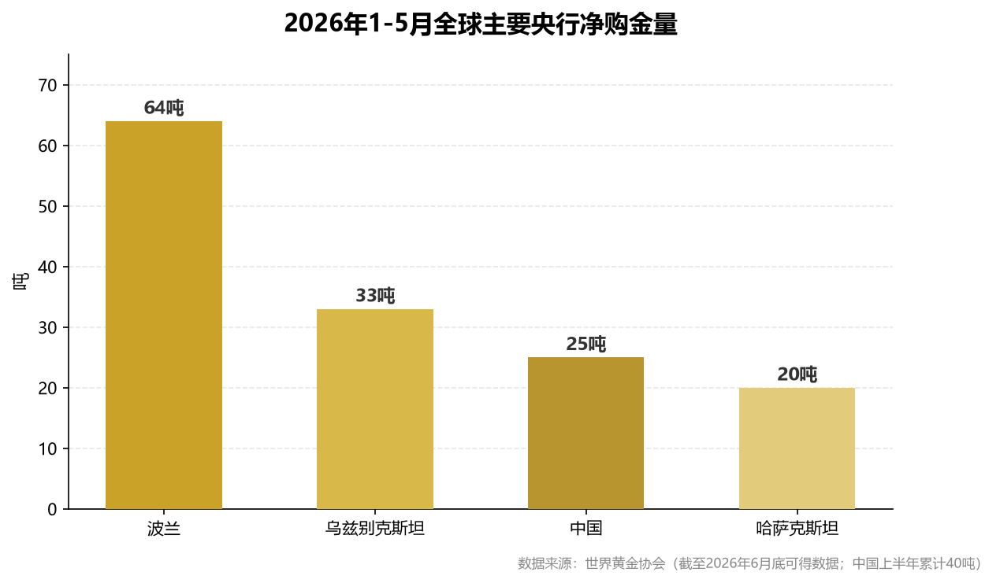
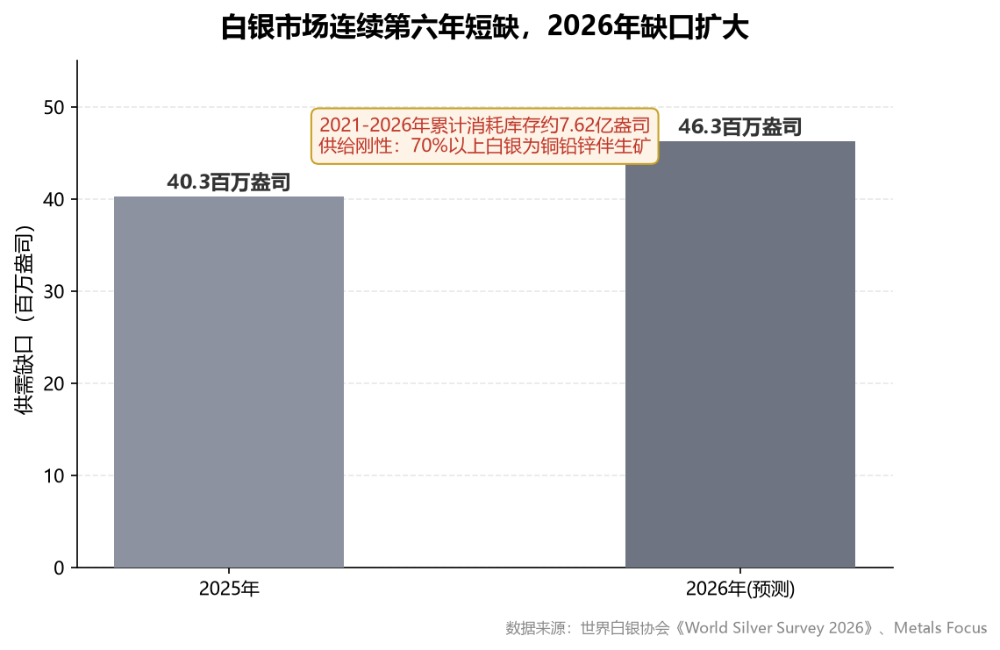
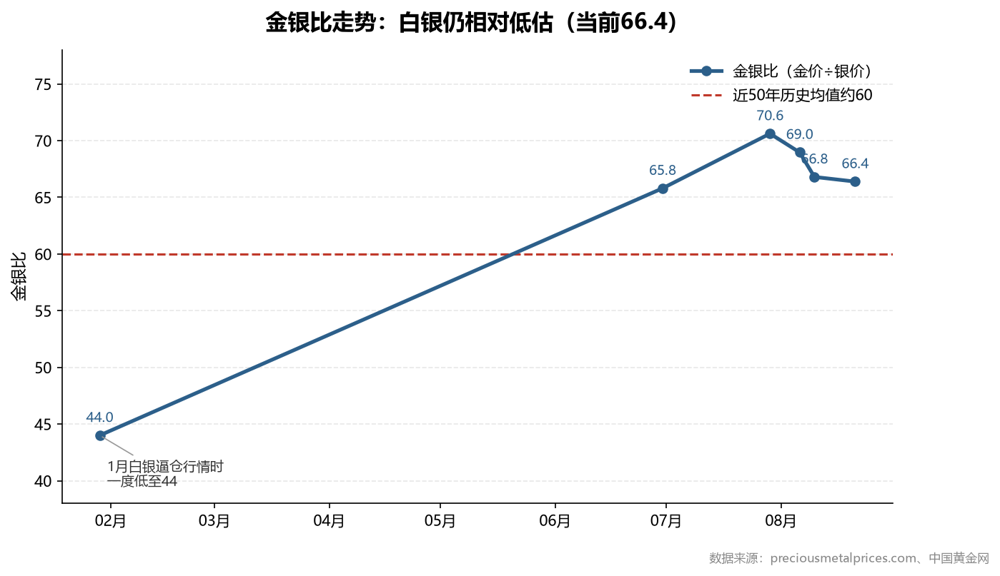
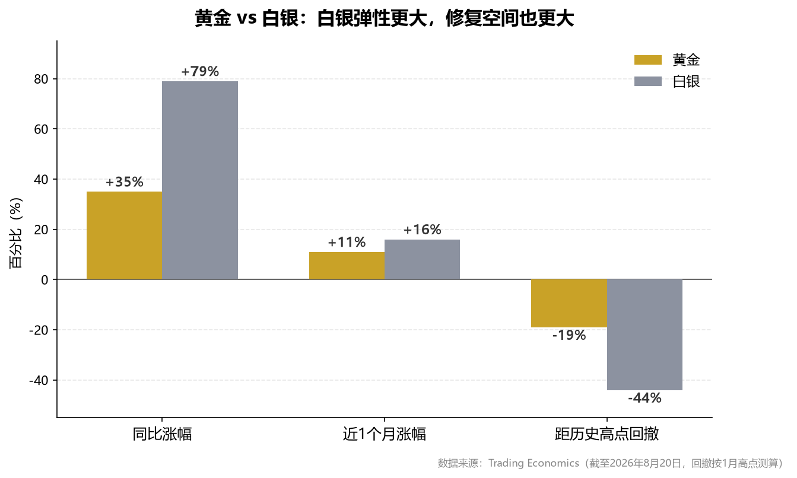

# 贵金属（黄金·白银）投资分析报告

## 摘要

本报告基于截至 **2026年8月21日** 的公开市场数据，对黄金、白银的行情结构、宏观驱动、供需基本面与投资策略进行系统分析。核心结论如下：

- **行情定位**：黄金当前约 **4,520美元/盎司**（同比 **+35%**），处于"1月历史高点5,608美元 → 深度回撤30% → 8月重启升势"的修复阶段；白银当前约 **68美元/盎司**（同比 **+79%**），距1月高点121.64美元仍有约44%空间，弹性显著大于黄金。
- **核心矛盾**：市场处于"**财政主导**（美国债务突破40万亿美元、财政部干预债市）与**货币紧缩**（美联储鹰派主席沃什、9月加息概率36.2%）"两股力量的拉锯中。前者决定长期方向向上，后者制造短期剧烈波动。
- **基本面支撑**：全球央行购金持续（二季度 **289吨**，同比 **+62%**）；白银连续第六年供需短缺（2026年预计缺口 **46.3百万盎司**）；金银比 **66.4** 仍高于历史均值60，白银存在相对低估。
- **策略判断**：黄金作为核心底仓逢回调分批布局；白银作为弹性增强品种，以金银比修复至60-65为中期目标，但须严格控制仓位与止损。**9月15-16日FOMC会议是四季度前最大的方向性变量**。

## 1. 引言

2026年是贵金属市场极不寻常的一年。黄金在1月冲上 **5,608美元** 的历史极值后经历40年最大单日跌幅，白银则在触及 **121.64美元** 后单日盘中闪崩36%。经历上半年的深度调整后，8月美国财政部扩大长期国债回购规模，再度点燃"贬值交易"，贵金属重拾升势。

本报告旨在回答三个问题：**本轮贵金属牛市的驱动因素是否仍然成立？黄金与白银谁的风险收益比更优？当前时点应如何配置与风控？** 报告数据来源于世界黄金协会、世界白银协会（Silver Institute）、Trading Economics、CME美联储观察工具及公开市场报道，所有关键数据均可追溯至文末参考文献。

## 2. 行情回顾：从极端狂热到深度洗牌，再到修复重启

### 2.1 黄金：历史高点后的"V型"修复

| 时点 | 价格（美元/盎司） | 事件 |
|------|------------------|------|
| 2026年1月初 | 约4,300 | 年初起涨 |
| 2026年1月29日 | **5,608** | 创历史新高 |
| 2026年1月30日 | 单日暴跌9.5% | 沃什提名+CME上调保证金+获利了结，40年最大单日跌幅 |
| 2026年6月底 | 约3,900+ | 最大回撤约30%，击穿4,000关口 |
| 2026年8月19-20日 | **4,522.78** | 财政部扩大回购，单日大涨超4% |
| 2026年8月21日 | 约4,520 | 同比+35%，距高点仍低约19% |

**分析**：黄金2026年的走势可划分为三个阶段。**第一阶段（1月）是杠杆驱动的加速冲顶**——单月涨幅超30%，RSI突破90，为随后的踩踏埋下伏笔；1月30日特朗普提名鹰派人物凯文·沃什出任美联储主席成为导火索，叠加芝商所月内第四次上调期货保证金，高杠杆多头被迫平仓，形成"下跌—强平—再下跌"的恶性循环。**第二阶段（2-6月）是货币紧缩定价的深度调整**——沃什释放缩表信号、通胀反弹、美元信用重建交易共同推动美元走强，金价最大回撤约30%，期间黄金ETF二季度净流出45吨，6月单月全球ETF流出约89亿美元。**第三阶段（8月至今）是财政主导逻辑下的修复重启**——8月19日美国财政部宣布将10-30年期国债回购上限翻倍至单次40亿美元，长端收益率回落、美元指数跌破99，金价单日大涨超4%突破4,500美元。值得注意的是，本轮修复伴随SPDR黄金ETF持仓8月增持27.6吨至1,034.65吨，显示西方资金开始回流，与中国机构在4,000美元关口的抄底形成东西方资金共振。

> 一句话真相：**1月的暴跌不是牛市终结，而是杠杆出清；8月的重启不是情绪反弹，而是财政信用折价的长逻辑定价。**

### 2.2 白银：腰斩之后，弹性正在回归

| 时点 | 价格（美元/盎司） | 事件 |
|------|------------------|------|
| 2025年12月 | 约84 | 2025年全年上涨42%后的高位 |
| 2026年1月底 | **121.64** | 创历史新高，金银比一度低至44 |
| 2026年1月30日 | 盘中闪崩36% | 约12万杠杆交易者爆仓42亿美元 |
| 2026年6-7月 | 60-70区间震荡 | 腰斩后筑底 |
| 2026年8月20日 | **68.09** | 两个月新高，同比+79% |

**分析**：白银的2026年比黄金更加极端。**从121.64美元到60美元附近，最大回撤接近50%**，远超黄金的30%——这正是白银的典型特征：市场规模仅为黄金的约十分之一、杠杆资金占比更高，价格对情绪变化的放大效应更强，波动率通常是黄金的1.5-2倍。1月闪崩中，白银市场约12万杠杆交易者爆仓、爆仓总额达42亿美元，是挤压效应最惨烈的一次演绎。但换个角度看，**深度出清也意味着筹码结构大幅改善**：伦敦市场可自由流通库存已从2025年9月底约1.36亿盎司的极度紧张状态回升至约2.5亿盎司，挤仓风险明显缓解，8月银价在61-62美元支撑区确认后重新站上68美元，月内涨幅约16%，强于黄金的11%。当前银价同比涨幅79%，约为黄金35%涨幅的2.3倍，弹性回归的信号已经明确。

> 一句话真相：**白银从来不会因为"便宜"而上涨，只会因为"弹性+资金回流"而暴涨——现在两个条件都在出现。**

## 3. 宏观驱动：财政主导与货币紧缩的拉锯战

### 3.1 财政主导：贬值交易的长逻辑

本轮贵金属牛市的底层叙事已从"美联储降息"切换为"**财政主导（Fiscal Dominance）**"：

| 关键事实 | 数据 |
|----------|------|
| 美国联邦政府债务 | 突破 **40万亿美元** |
| 30年期美债收益率 | 5.26%，逼近近20年高位5.34% |
| 财政部干预 | 8月19日宣布10-30年期国债回购上限翻倍至单次40亿美元，并称"还能加码" |
| 黄金占全球官方储备 | **27%**（2025年底），超越美债的22%，成为第一大储备资产 |
| 美元储备份额 | 从60%以上降至约50% |

**分析**：理解当前金价的关键，是理解"谁在替美债信用定价"。30年期美债收益率逼近20年高位，本质上是市场对美国长期信用投下的不信任票——收益率上行不再仅仅代表"资金成本上升"，更包含了"**美元信用折价**"。8月19日财政部的回购干预，短期压低了长端收益率、提振了金价，但效果仅维持一个交易日，30年期收益率随即重返5.26%。这一细节极其重要：**它说明市场对"技术性干预"的信任度有限，财政货币化（用印钞买债压低利率）的长期预期反而被进一步强化**。对黄金而言，这构成两难中的确定性——无论美联储选择加息抗通胀（债务利息负担更重、信用更受损），还是选择容忍通胀（实际利率为负），黄金都是受益方。日本6月减持美债264亿美元、英国减持87亿美元，多国主权机构持续"减美债、增黄金"，正是这一逻辑的机构化表达。

### 3.2 货币紧缩：短期波动的来源

与长期逻辑相悖的是短期货币政策环境：

| 关键事实 | 数据 |
|----------|------|
| 联邦基金利率 | 3.50%-3.75%，已连续5次会议维持不变 |
| 美联储主席 | 凯文·沃什（鹰派），强调价格稳定、减少前瞻指引 |
| 7月FOMC投票 | 9票维持、**3票主张加息25个基点** |
| 美国CPI（7月） | **3.4%**，核心PCE高于3% |
| 9月会议预期（CME） | 维持不变概率63.8%，**加息25基点概率36.2%**，降息概率不足1.5% |
| 布伦特原油 | 93.78美元/桶，中东冲突推高通胀粘性 |

**分析**：2026年下半年贵金属面临的最大短期逆风，是美联储从"暂停"转向"再加息"的可能性。7月会议纪要显示多位官员认为"若通胀未能回落至2%，进一步收紧政策可能是必要的"，且有三位委员已投票支持加息；摩根大通等机构已将对9月会议的预测调整为加息25个基点。驱动通胀的是两个短期难以消解的因素：一是美伊冲突导致霍尔木兹海峡通航受限，布伦特原油站稳90美元上方；二是关税传导与供应链扰动。对贵金属而言，这意味着**波动率将维持高位**——每一次超预期的通胀或就业数据，都可能引发"加息预期升温→实际利率上行→金价回调"的链条反应。但需要注意边界：在40万亿美元债务基数上，加息空间被财政承受能力严格限制，紧缩是"有限的紧缩"，这决定了回调的深度有限。8月20日金价盘中跌破4,500美元后当日收复、自低点反弹逾2%，正是多空拉锯的现场写照。

> 一句话真相：**长期看财政信用贬值（利多），短期看货币紧缩反复（利空）——贵金属交易的本质是"用短期的波动换取长期的确定性"。**

## 4. 供需基本面：央行购金托底黄金，工业短缺支撑白银

### 4.1 黄金：央行购金是最坚实的底部力量

| 需求/供给分项 | 2026年二季度 | 2026年上半年 |
|--------------|-------------|-------------|
| 总需求（含场外） | 1,269吨（同比持平） | 2,522吨（+2%），价值3,800亿美元创新高 |
| **央行购金** | **289吨（+62%）** | 345吨 |
| 金条与金币 | 307吨（持平） | 784吨（+21%，2013年以来最强半年） |
| 黄金ETF | 净流出45吨 | 净流入18吨（8月SPDR再增27.6吨） |
| 金饰需求 | 278吨（-17%） | 572吨，但消费金额+22%至860亿美元 |
| 金矿供应 | 966吨（+2%） | 回收金-6% |

**分析**：2026年黄金市场最重要的结构特征，是"**西方金融资本卖出、东方实物资本与各国央行买入**"的对立统一。二季度黄金ETF净流出45吨、6月单月流出89亿美元的同时，全球央行净购金289吨、同比大增62%，金条金币需求创2013年以来最强上半年表现——两股力量方向相反，决定了金价"跌不深、底部持续抬升"的格局。央行购金的持续性有制度性保障：世界黄金协会2026年调查显示，**45%的受访央行计划未来12个月增持黄金，比例创历史纪录**，89%预计全球官方储备将继续增加。中国央行已连续20个月增持、上半年累计购入40吨，但黄金仅占中国外汇储备的8%-10%，对比新兴市场17%-20%的平均水平和发达国家50%以上的水平，增持空间巨大。瑞银预计全年央行购金750-1,000吨，这一"不计价格、按月执行"的刚性买盘，是黄金区别于一切投机资产的核心特征。高金价压制了金饰消费量（-17%），但消费金额反而增长22%——这恰恰说明黄金的货币属性正在压倒商品属性。

### 4.2 白银：连续六年短缺，但需求结构正在换挡

| 供需分项 | 2025年 | 2026年（预测） |
|----------|--------|---------------|
| 市场缺口 | 40.3百万盎司 | **46.3百万盎司（扩大）** |
| 总需求 | 11.31亿盎司 | 约11.3亿盎司（-2%） |
| 工业需求占比 | 约60% | 57%-60% |
| 光伏用银 | 1.87亿盎司（-6%） | **1.51亿盎司（-19%）** |
| 电子电气用银 | — | **+18%**（AI服务器、5G、芯片） |

**分析**：白银基本面是"强短缺"与"需求换挡"的复合体。**短缺是硬约束**：2026年将录得连续第六年供不应求，且缺口从40.3百万盎司扩大至46.3百万盎司；2021-2026年累计约7.62亿盎司的库存消耗，把市场的缓冲垫磨到了历史低位。供给端的刚性几乎无解——全球70%以上的白银是铜、铅、锌矿的伴生副产品，银价上涨无法刺激独立扩产，新矿山从勘探到投产需要5-10年。**但需求结构的变化必须正视**：光伏这个最大单一工业用途正在"去银化"，银占组件成本超17%倒逼银包铜、0BB无主栅、电镀铜技术加速落地，2026年光伏用银预计下降19%。对冲力量来自AI与电气化——AI训练服务器单机柜耗银量比传统机型高约30%，新能源车单车用银量为燃油车的1.5-2倍，电子电气用银2026年增长18%。中国6月银矿进口同比激增62.5%至21.9万吨，印证了工业补库的真实需求。综合判断：**短缺托底+工业换挡，白银下行有底、上行有顶，除非再次出现类似2025年的流动性挤仓，否则单边翻倍行情难以复制**。

> 一句话真相：**黄金买"信用贬值"，白银买"短缺+弹性"——前者是长坡厚雪，后者是锋利的刀。**

## 5. 黄金 vs 白银：金银比视角下的相对性价比

| 维度 | 黄金 | 白银 |
|------|------|------|
| 当前价格 | 约4,520美元 | 约68美元 |
| 同比涨幅 | +35% | **+79%** |
| 距历史高点回撤 | 约-19% | **约-44%（修复空间大）** |
| 波动率 | 基准 | 黄金的1.5-2倍 |
| 核心驱动 | 央行购金、信用对冲（纯度高的货币逻辑） | 货币逻辑+工业短缺（双重属性） |
| 机构目标价 | 德银/瑞银年底4,600；花旗4,500 | 摩根大通均价81；汇丰75；花旗70；美银看100+ |
| 角色定位 | **底仓、压舱石** | **弹性增强、进攻仓位** |

**分析**：金银比是衡量两者相对估值最直观的工具。当前金银比 **66.4**，高于近50年均值60，也高于历史中位数61.6——这意味着**白银相对黄金仍被低估约10%**。历史规律显示，贵金属牛市中后段，资金往往从黄金溢出追逐低估的白银，推动金银比向均值回归：若回归至60-65，对应银价有约10%的修复空间（看向75-76美元）；若回归至55-60的乐观区间，银价可看78-80美元，与摩根大通81美元的全年均价预测、Trading Economics十二个月79.6美元的模型预测形成交叉验证。但必须强调两个约束条件：其一，**金银比回归不具备必然性**——1月该比值曾低至44，极端宏观环境下也可能长期维持高位，白银的高估与低估都可以持续很久；其二，**弹性是双刃剑**——白银跌起来同样比黄金快，1月闪崩36%的教训要求仓位必须轻于黄金、止损必须严于黄金。对配置型投资者，合理的结构是"黄金为盾、白银为矛"：黄金提供组合的稳定性和信用对冲，白银提供进攻弹性，两者比例可根据金银比动态再平衡——比值高于70时增配白银，低于50时减配白银。

> 一句话真相：**金银比66意味着"黄金已经证明了自己，白银还在等待证明"——而后者往往才是超额收益的来源。**

## 6. 风险因素：必须直视的四只"灰犀牛"

| 风险 | 触发条件 | 影响 | 概率评估 |
|------|----------|------|----------|
| **9月FOMC加息** | 8-9月通胀数据超预期 | 实际利率上行，贵金属快速回调5-10% | 中（CME概率36.2%） |
| **获利了结** | 金价月涨10%+后情绪过热 | 短线回调至4,400-4,450 | 中高 |
| **杠杆踩踏重演** | CME再度上调保证金 | 白银闪崩风险（参考1月30日） | 低-中 |
| **光伏去银化超预期** | 银包铜技术规模化提前 | 白银工业需求预期下修 | 中（慢变量） |

**分析**：风险的排序比风险的罗列更重要。**排在首位的是9月15-16日FOMC会议**——这是四季度前唯一可能改变贵金属中期方向的事件。基准情形（63.8%概率）是维持利率不变，贵金属延续"财政主导"的修复逻辑；但若8月CPI再度上行（油价93美元的传导尚未完全体现），加息落地将直接触发"实际利率上行→ETF流出→金价回调"的链条，回调幅度参考历史可能在5%-10%。**第二是交易层面的拥挤度风险**：金价月内涨超10%、银价涨超16%后，短线获利盘堆积，8月20日金价盘中破4,500美元即是预演；1月30日的暴跌证明，在杠杆工具普及的市场结构中，"涨得快"本身就是风险。**第三是白银特有风险**：iShares白银ETF持仓8月以来反复（15,275吨，较高点回落），若ETF持续流出叠加CME上调保证金，白银可能重演闪崩。**第四是慢变量**：光伏去银化不会在今年颠覆白银需求，但会逐年压缩其工业叙事的空间，这决定了白银的每一次工业属性炒作都需要"见好就收"。应对这些风险的唯一有效方法，是事先确定仓位上限、分批节奏和止损纪律，而不是事到临头再做决策。

> 一句话真相：**贵金属的风险从来不在于"逻辑错了"，而在于"用错误的仓位交易正确的逻辑"。**

## 7. 投资策略：以黄金为盾、以白银为矛

### 7.1 配置框架

| 品种 | 角色 | 建议仓位（占可投资产） | 布局方式 | 目标位 | 止损/纪律 |
|------|------|----------------------|----------|--------|-----------|
| 黄金（ETF/金条） | 核心底仓 | **5%-15%** | 回调至4,400-4,450区间分批买入 | 4,600（德银/瑞银年底目标）→4,790（12个月模型） | 不止损底仓，但避免在单日大涨4%后追入 |
| 白银（ETF/期货） | 弹性进攻 | **≤5%，轻于黄金** | 金银比>70时增配，回调至61-65区间介入 | 75-80（金银比回归60-65） | 严格止损，跌破58-60支撑区离场 |
| A股贵金属板块 | 弹性替代 | 视风险偏好 | 金银价格回调但股价抗跌时介入 | — | 波动大于实物，仓位减半 |

### 7.2 具体投资标的（截至2026年8月20日）

**（1）实物与基金类——底仓工具（适合所有投资者）**

| 标的 | 代码 | 定位与介入逻辑 | 注意事项 |
|------|------|---------------|----------|
| 华安黄金ETF | 518880 | 跟踪国内金价，规模与流动性居首，**底仓首选** | 金价回调至4,400-4,450美元区间分批买入 |
| 易方达黄金ETF | 159934 | 同类备选，费率相当 | 同上 |
| 银行积存金/投资金条 | — | 超长期压舱石，忽略短期波动 | 只在回调时加，不追高 |
| 国投瑞银白银期货LOF | 161226 | **国内唯一白银主题基金**，无期货账户者的白银工具 | 跟踪沪银期货，存在移仓损耗，适合波段不适合长持 |
| SPDR GLD / iShares SLV | 美股 | 有境外账户者的直连工具 | 注意汇率因素 |

**（2）黄金股——弹性主力仓**

| 标的 | 代码 | 核心逻辑（买入理由） | 估值锚与目标 |
|------|------|---------------------|--------------|
| 山东黄金 | 600547 | **A股纯金龙头**。2026年Q1净利同比+102%，克金成本仅220-250元/克，金价上涨几乎全部转化为利润；中期分红10派1元 | 2026年一致预期净利68-72亿元，前瞻PE仅16-17倍（历史中位25-30倍）；若回归25倍PE，对应市值1,700亿以上 |
| 赤峰黄金 | 600988 | **民营弹性标的**。上半年预增54%-61%，黄金销售均价同比+43%，机制灵活、产量爬坡 | 8月20日涨停，弹性大于山金，回调时优先布局 |
| 中金黄金 | 600489 | **央企压舱石**。上半年预增52%-71%，金铜双属性，硫酸等副产品增厚利润 | 估值低于民营同行，防御性强 |
| 紫金矿业 | 601899 | **确定性最强的矿业龙头**。8月20日特大单净流入18.21亿元居两市首位 | 铜属性稀释纯金弹性，适合作为有色综合配置而非纯金标的 |
| 黄金股ETF | 517520 | **一键打包**，规避个股黑天鹅 | 适合不想选股的投资者，弹性约为金价2倍 |

**（3）白银股——高弹性卫星仓（仓位须轻于黄金股）**

| 标的 | 代码 | 核心逻辑（买入理由） | 风险提示 |
|------|------|---------------------|----------|
| 兴业银锡 | 000426 | **白银首选**。手握中国34.56%白银储量（亚洲第一、全球第七）；上半年预增169%-198%（净利21.4-23.7亿元）；8月19日动态PE仅11.93倍；银漫二期2028年投产、宇邦扩建后白银产量有望达1,000吨/年；8月26日分红登记（10派1.1元）、**8月29日披露中报** | 要约收购*ST威领（18元/股、不超18亿元）存在市场争议；8月20日已涨停，短线追高需谨慎，等回踩 |
| 盛达资源 | 000603 | **A股唯一以独立原生银矿为主业的标的**，银价纯度最高；市值约230亿元，小盘高弹性；鸿林矿业菜园子铜金矿已投产；8月12日获广发证券、泰康资产等机构调研 | PE TTM约27倍高于兴业；8月18日出现股民维权征集信息（信披争议），**仓位应更轻、止损应更严** |

**（4）进出场触发条件（明确执行规则）**

| 操作 | 触发条件 | 对应动作 |
|------|----------|----------|
| **买入** | 金价回调至4,400-4,450美元 | 加仓黄金ETF、山东黄金 |
| **买入** | 金银比升至70以上 | 加仓白银标的（兴业银锡优先） |
| **买入** | 9月FOMC若加息引发恐慌性回调 | 逆向买入窗口，分批抄底 |
| **买入** | 兴业银锡8月29日中报超预期且股价回踩不破 | 加仓白银首选标的 |
| **止盈** | 金价接近4,600-4,790美元 | 黄金仓位分批兑现 |
| **止盈** | 兴业银锡接近48-51元机构目标区 | 分批兑现（国泰海通目标价48.4元） |
| **止盈** | 金银比回落至50以下 | 白银仓位换回黄金 |
| **止损** | 白银股自买入价下跌15% | 无条件离场 |
| **止损** | 金价有效跌破4,350美元 | 黄金股减仓，保留实物底仓 |

**分析**：标的组合的逻辑是"**三层结构**"——第一层实物/ETF（黄金ETF为主）提供确定性，赚金价本身的钱；第二层黄金股（山东黄金+赤峰黄金为核心）提供经营杠杆，历史规律显示金矿股在金价上行期的涨幅约为金价的2倍，且当前板块估值（山金前瞻PE16-17倍）处于历史底部区域，即便金价横盘，仅靠业绩兑现（板块上半年普遍预增50%-260%）也有修复空间；第三层白银股（兴业银锡+盛达资源）提供最大的价格弹性，但必须以最小仓位参与——兴业银锡11.9倍动态PE对应169%-198%的利润增速、PEG远小于1，是板块中罕见的"低估值+高增速"组合，但其收购争议与盛达资源的信披争议提醒我们：**弹性标的的每一分钱仓位都要有止损预案**。执行上建议"底仓+机动仓"分离：底仓（ETF+山东黄金）中期持有不动，机动仓利用板块日内波动做T降低成本——板块单日急拉5%以上时卖出机动仓，回调2-3%时接回，这与"大涨不追、回调敢买"的总纪律一脉相承。需特别注意，8月20日贵金属板块已集体大涨（多股涨停），短线追高风险大，理想的介入时点是板块缩量回踩5日均线或金价回踩4,400-4,450美元支撑之时。

> 一句话真相：**金价涨30%，山东黄金们能赚翻倍，兴业银锡们能赚两倍——但反过来也成立，所以仓位的大小必须与波动的承受力匹配。**

### 7.3 节奏与关键时点

**分析**：节奏上建议分三步走。**第一步（8月下旬）**：金价短期涨幅已大（月+10%），不追高，等待获利了结带来的回调——4,400-4,450美元是前期震荡平台顶部的"顶底转换"支撑区，也是分批介入的第一目标区；白银对应关注65美元附近。**第二步（9月中旬FOMC前后）**：这是全年最重要的分歧窗口。若会议维持利率不变（基准情形），贵金属确认升势，可顺势加仓；若意外加息，市场大概率出现"恐慌性回调"，而这恰恰是逆向布局的黄金坑——因为在40万亿美元债务约束下，加息不可持续，"紧缩定价"越是极端，随后的修复越是确定。**第三步（四季度）**：若通胀数据见顶回落+财政回购持续加码，贵金属有望挑战前高——黄金看4,600-4,790，白银看75-80。全程需要遵守三条纪律：一是**仓位纪律**，贵金属总仓位不超过可投资产的15%-20%，白银单独不超过5%；二是**工具纪律**，配置型资金优先选择实物金条、黄金ETF等无杠杆工具，期货等杠杆工具仅限小仓位且严格止损；三是**情绪纪律**，逆向思维——在单日大涨、全网热议时不追（参考1月冲顶），在恐慌性回调、加息预期最浓时敢买（参考6月底部）。

> 一句话真相：**这轮行情的正确姿势不是"预测顶部"，而是"底仓不动+回调敢买+大涨不追"。**

## 8. 结论

贵金属市场正在经历定价范式的深刻切换：从"利率与美元的机会成本定价"转向"财政信用与货币体系重构的定价"。40万亿美元的联邦债务、逼近20年高位的长端收益率、黄金超越美债成为全球第一大储备资产——这些事实共同指向一个结论：本轮牛市的底层逻辑（美元信用折价与全球储备多元化）不仅没有因上半年的深度回调而削弱，反而在回调中获得了央行购金289吨、金条金币需求创13年新高的数据确认。黄金与白银的分化则揭示了市场的层次：黄金是机构与央行的"确定性资产"，白银是叠加了工业短缺叙事的"弹性资产"，金银比66.4所隐含的相对低估，为后者保留了修复空间。短期而言，9月FOMC会议的加息博弈与月内10%涨幅后的获利了结压力，决定了波动仍将是常态；但供给刚性（央行购金、白银六年短缺）与需求韧性（AI与电气化用银）构成的基本面底盘，使得每一次由紧缩预期引发的回调，都更接近机会而非风险。客观地说，贵金属已不处于"便宜的起点"，而是处于"昂贵但有支撑的中段"——这要求投资者以配置而非投机的心态参与，用仓位管理和分批纪律来消化高波动，用金银比的动态再平衡来获取相对收益。

## 9. 参考文献

[1] 世界黄金协会. 2026年二季度《全球黄金需求趋势报告》[EB/OL]. https://china.gold.org/, 2026-07-30.

[2] 世界黄金协会. Central Bank Gold Statistics: Central banks remain committed to gold[EB/OL]. https://www.gold.org/, 2026-07.

[3] The Silver Institute & Metals Focus. World Silver Survey 2026[EB/OL]. https://silverinstitute.org/, 2026-04.

[4] Trading Economics. Gold / Silver - Price, Chart, Historical Data[EB/OL]. https://zh.tradingeconomics.com/commodity/gold, 2026-08-20.

[5] 上海证券报. 黄金，多极时代的新底仓？[EB/OL]. http://m.toutiao.com/group/7676180781970047540/, 2026-08-20.

[6] 华尔街见闻. 早餐FM-Radio 2026年8月21日[EB/OL]. http://m.toutiao.com/group/7676253748703805987/, 2026-08-21.

[7] 每日经济新闻. 美联储9月维持利率不变的概率为63.8%[EB/OL]. http://m.toutiao.com/group/7676242900904165940/, 2026-08-21.

[8] Polymarket Intel. Polymarket Signals Strong Doubt on Fed Rate Cut in September 2026[EB/OL]. https://polymarketintel.com/, 2026-08-14.

[9] 中国黄金网. 金价涨了，银价也可能迎来补涨机会？[EB/OL]. https://cj.sina.cn/, 2026-08-07.

[10] Discovery Alert. Silver Market Deficit Widens in 2026 Despite Falling Solar Demand[EB/OL]. https://discoveryalert.com.au/, 2026-08-20.

[11] 什么值得买. 白银半年坐过山车：从120到60被套还是机会？[EB/OL]. https://post.m.smzdm.com/p/apq62mwx/, 2026-08-06.

[12] 什么值得买. 2026年1月30日国际金价单日暴跌超12%，创40年最大跌幅[EB/OL]. https://post.m.smzdm.com/p/awm4684m/, 2026-02-01.

[13] 看点资讯. 黄金走势：2026年08月20日金价突破4500美元创阶段新高[EB/OL]. https://cj.sina.com.cn/, 2026-08-20.

[14] preciousmetalprices.com. Gold-Silver Ratio Current & Historical[EB/OL]. https://www.preciousmetalprices.com/, 2026-08-21.

[15] 新浪财经. 对话鲁政委、宋雪涛：2026年金价反常走势背后的核心逻辑[EB/OL]. https://cj.sina.cn/, 2026-07-22.

[16] 中新经纬. 多家黄金股预喜：招金、西部上半年净利涨数倍，中金、赤峰等两位数增长[EB/OL]. https://finance.sina.com.cn/, 2026-07-14.

[17] 东方财富网. 为什么是兴业银锡（储量、产能、估值分析）[EB/OL]. https://caifuhao.eastmoney.com/, 2026-08-19.

[18] 东方财富网. 快速拉升！黄金股，掀"涨停潮"[EB/OL]. https://finance.eastmoney.com/, 2026-08-20.

[19] 山东黄金矿业股份有限公司. 关于2026年中期利润分配方案的公告[EB/OL]. 证券日报, 2026-07-22.

[20] 同花顺财经. 兴业银锡(000426)公司资料与异动提醒[EB/OL]. http://basic.10jqka.com.cn/000426/, 2026-08-20.
