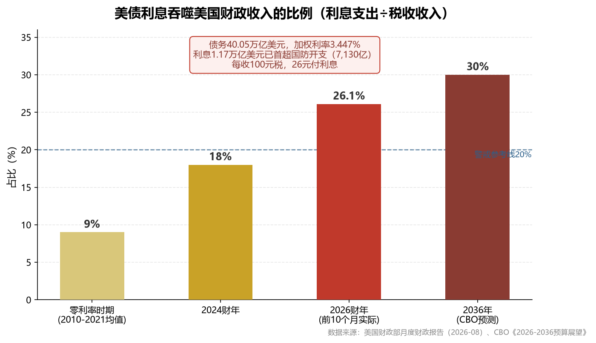
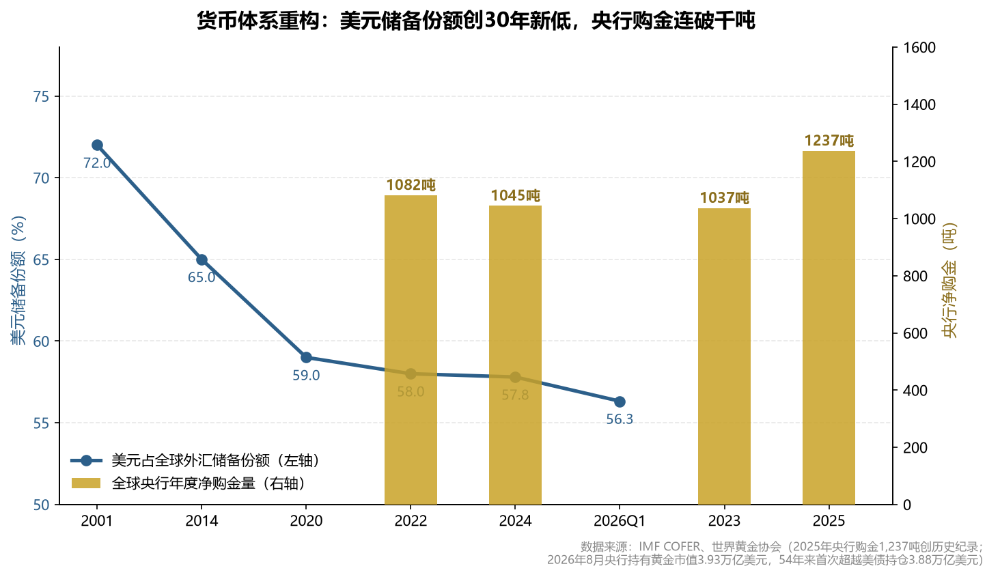
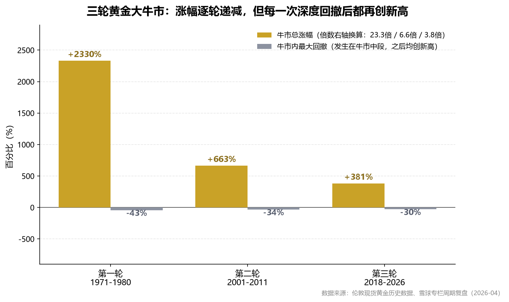

# 贵金属（黄金·白银）深度分析报告：财政纪元下的定价革命

> ©️ 景琦居 · 2026年8月23日 · 版权所有

## 摘要

本报告以贵金属分析师、宏观经济学家、地缘政治研究者与交易群体行为分析者的复合视角，对截至 **2026年8月23日** 的黄金、白银市场进行深度推演。与常规报告不同，本报告开门见山给出五个可证伪的核心判断，随后用数据链条逐层论证，最终落地为一份可直接执行的操作手册。

**核心判断**：黄金当前约4,600美元，本轮牛市（2018年启动）**未终结**；美国债务数学已进入不可逆区间，央行购金是制度性行为而非周期性行为；短期（9月FOMC前后）回调概率约70%，但**回调是买点而非卖点**；黄金类仓位建议不超过可投资产15%，白银类不超过5%。

## 1. 核心判断：五个可证伪的观点

好的分析不是模糊的正确，而是明确的、可以被数据推翻的判断。本报告的全部结论浓缩为下表：

| # | 判断 | 内容 | 置信度 | 可证伪条件（什么情况说明我错了） |
|---|------|------|--------|--------------------------------|
| 1 | **方向** | 本轮黄金牛市未终结，2026年上半年-30%回撤是牛市**中期调整**，而非终结信号 | 75% | 美联储连续加息2次以上且实际利率持续转正上行 |
| 2 | **空间** | 12个月黄金目标4,900-5,200美元（基准），乐观5,600（重上前高）；白银75-85美元 | 60% | 金价有效跌破4,100美元（年内低点3,942下方） |
| 3 | **节奏** | 短期（9月15-16日FOMC前后）回调概率70%，第一支撑4,400，深度回调区间4,300-4,100 | 70% | 金价不回调直接突破4,800（踏空风险，用底仓应对） |
| 4 | **结构** | 央行购金是**制度性配置**（去美元化基建已落地），不是投机性追涨，这决定了金价"跌不深" | 80% | 全球央行购金连续两个季度低于500吨年化水平 |
| 5 | **仓位** | 黄金类≤15%（底仓8%+机动7%），白银类≤5%，当前时点**不追高、等回踩** | — | 无需证伪，这是纪律 |

**一句话总纲：长逻辑（债务货币化）决定"必须持有"，短节奏（FOMC+拥挤度）决定"何时买入"。当前的正确动作是：持底仓、留弹药、等回踩、按预案执行。**

## 2. 宏观驱动：债务数学的不可逆与政治经济学的必然

### 2.1 利息螺旋：一道无解的数学题

| 指标 | 数据 | 含义 |
|------|------|------|
| 联邦债务总额 | **40.05万亿美元**（8月18日） | 为GDP的122%，是国际警戒线（60%）的两倍 |
| 债务加权利率 | 3.447% | 低息旧债正以4-5%利率置换，该值仍在被动上升 |
| 利息支出（2026财年前10个月） | **1.17万亿美元**（同比+15%） | **历史上首次超过同期国防开支（7,130亿美元）** |
| 利息占税收比例 | **26.1%** | 每收100元税，26元付利息；零利率时期仅约9% |
| CBO预测（2036年） | 利息2.1-2.5万亿美元 | 届时吞噬近半财政收入 |
| 美债增量（过去12个月） | +3万亿美元 | 非疫情时期历史最快；每5个月新增1万亿 |

**推演**：利息增速（+15%/年）与税收增速（约+5%/年）之间的裂口，决定了"利息占税收比例"这条曲线**在数学上无法收敛**——除非利率大幅下降，而利率下降只有两条路：要么通胀回落（油价93美元、关税传导下短期看不到），要么美联储压低利率（即债务货币化，黄金的终极利多）。桥水创始人达利欧的判断是：按当前轨道，债务危机"三年内，上下误差两年"。

### 2.2 政治经济学：为什么三条出路全部堵死

打破债务螺旋理论上只有三条路，逐条检验：

| 出路 | 现实检验 | 结论 |
|------|----------|------|
| **削减赤字** | 社保+医保+利息占联邦支出约三分之二，均为法定刚性支出；选举周期（2-4年）与债务周期（30年）错配，任何一届政府都不敢动选民福利 | **政治上不可能** |
| **技术性违约** | 美元的储备地位建立在"美债无风险"的信仰上，违约等于自杀 | **不敢** |
| **通胀化债/金融抑制** | 用通胀与低实际利率稀释债务实际价值——这是历史上罗马帝国、1970年代美国、2010年代日本共同的选择 | **唯一可行之路** |

**这就是黄金牛市的第一性原理**：当一国债务大到只能靠"印钱+压低实际利率"来维持时，债权人（美债持有者）必然要求补偿，而黄金是唯一**不依赖任何债务人偿付能力**的资产。1970年代美国用7年负实际利率消化越战债务，同期黄金涨了23倍；2026年的美国债务/GDP（122%）已超过1946年二战峰值（106%），但今天没有战后那样的增长奇迹来稀释它。

### 2.3 "贝森特看跌期权"拆解：回购的本质与市场的信任投票

8月19日财政部宣布10-30年期国债回购上限翻倍至单次40亿美元，金价当日涨超4%。但拆开看：

- **体量**：巴克莱测算全年回购约640亿美元，仅占20-30年期国债年度发行量的15%；德银直言相对32万亿美元存量"微不足道"。
- **实质**：回购资金来自增发短期国库券——不是消灭债务，只是把长债换成短债，总债务一分未减，且把偿付风险暴露在短端利率波动下（若美联储加息，滚动成本立刻飙升）。
- **市场的投票**：回购次日，20年期美债中标收益率5.204%创2004年以来新高；30年期收益率两天内重返5.28%。**市场用真金白银宣告：技术性干预接不住天量供给。**

**结论**：财政部回购不是利空黄金，恰恰相反——它证明了美国财政已进入"必须干预"的阶段，而干预的尽头是财政货币化。华尔街称之为"贝森特看跌期权"：市场预期财政部会在长端收益率失控时托市。这个预期本身，就是黄金定价的一部分。

## 3. 地缘与货币体系重构：央行用脚投票的制度性买盘

### 3.1 从"叙事"到"基建"：去美元化已完成基础设施落地

| 里程碑事件 | 时间 | 意义 |
|-----------|------|------|
| 俄罗斯约3,000亿美元储备被西方冻结 | 2022年 | 全球央行行长集体的心理转折点：**存在西方体系的储备，说冻结就冻结** |
| 美元储备份额跌破57% | 2026年Q1（56.32%） | 30年最低；2001年该值为72%，趋势连续8个季度下行 |
| **央行持有黄金市值首超美债持仓** | 2026年8月 | 黄金3.93万亿美元 vs 美债3.88万亿美元，**54年来首次** |
| BRICS Pay支付系统上线 | 2026年 | 整合CIPS、SPFS等，成员国本币结算绕开SWIFT |
| "The Unit"数字结算代币推出 | 2026年 | **40%黄金+60%成员国货币篮子**——黄金正式进入新结算体系的价值锚 |
| 金砖内部本币结算占比 | 67% | 石油美元体系出现实质裂缝（沙特对华石油人民币结算已达41%） |
| 沙特对华石油人民币结算 | 41% | 石油美元根基松动 |

**关键认知**：很多人把去美元化当作"情绪叙事"，但2026年的区别在于**基建已经落地**——BRICS Pay可结算、The Unit有黄金锚、本币贸易占比可量化。当一套替代基础设施开始运转，参与者的资产配置行为就从"观点"变成了"必须"（用对手方体系做贸易，就要持对手方认可的抵押品）。

### 3.2 央行行为的性质：制度性配置的三个证据

| 证据 | 数据 |
|------|------|
| **持续性** | 2022-2025年全球央行年度购金：1,082 → 1,037 → 1,045 → **1,237吨（历史纪录）**，连续四年破千吨；此前50年均值不足500吨 |
| **广度** | 世界黄金协会2026年调查：**73%的央行预计美元储备份额将继续下降，43%计划增持黄金**（2021年仅21%） |
| **中国维度** | 央行连续21个月增持，7月单月+64万盎司（约20吨）创两年最大单月增幅；黄金仅占中国外储8-10%，对比新兴市场均值17-20%，**增持远未到位** |

**一个必须诚实呈现的反例**：俄罗斯央行2026年以来卖出43.5吨黄金（储备降至2,282吨，2020年以来最低），用于填补4.6万亿卢布的战争赤字。但注意细节——俄罗斯卖的是黄金，**恰恰因为被冻结的美元和欧元动不了，黄金是它唯一能变现的储备**。这反向证明：对被制裁风险有切肤之痛的国家来说，黄金是"最后的钱"。卖金的俄罗斯是特例（战争融资），买金的央行是普遍现象（制度配置），两者的方向差异不构成对趋势的否定。

## 4. 周期定位：我们身处三轮牛市的什么位置

### 4.1 三轮牛市对照：历史不会重复，但会押韵

| 维度 | 第一轮（1971-1980） | 第二轮（2001-2011） | 第三轮（2018-至今） |
|------|---------------------|---------------------|---------------------|
| 起点→峰值 | 35→850美元 | 252→1,921美元 | 1,160→5,608美元 |
| 总涨幅 | +23.3倍 | +6.6倍 | +3.8倍 |
| 牛市内最大回撤 | **-43.2%**（1974-1976） | **-34.0%**（2008金融危机） | **-30.0%**（2026年上半年） |
| 回撤后表现 | 再涨+717%至顶点 | 再涨+182%至顶点 | **？** |
| 终结原因 | 沃尔克加息至20%+美元超级牛市 | QE退出+美元走强+经济复苏 | **尚未发生** |
| 随后熊市 | -70%，19.6年 | -45%，4年 | — |

**三个周期规律**：

1. **每轮牛市都有一次-30%以上的中期深蹲**，而深蹲之后的路程往往才是最陡峭的主升段（1976年调整后18个月+717%，2008年调整后3年+182%）。2026年上半年的-30%回撤（5,608→3,942）在周期尺度上是**常态而非异象**。
2. **牛市终结从来不是散户行为造成的，而是央行（美联储）行为逆转造成的**。1980年需要沃尔克把利率加到20%、美元指数5年涨50%；2011年需要QE明确退出。散户的狂热只能制造"阶段性顶部"（如1月的5,608），不能终结牛市。
3. **涨幅逐轮递减（23倍→6.6倍→3.8倍），但回撤也逐轮收窄（-43%→-34%→-30%）**——因为黄金市场体量扩大、央行购金形成托底。本轮即便再创新高，也不宜期待短期翻倍式暴涨，而应预期"震荡上行+中枢抬升"。

### 4.2 牛市终结条件核对清单：当前零触发

| 终结条件（历史必要条件） | 1980年 | 2011年 | **2026年8月当前状态** |
|--------------------------|--------|--------|----------------------|
| ① 美联储持续激进加息、实际利率大幅转正 | 利率20% | QE退出+2015加息 | **未触发**：利率3.50-3.75%，9月加息概率33-40%（非农爆冷后从67%回落），实际利率仍为负 |
| ② 美元进入超级牛市 | 美元指数5年+50% | 美元指数2014-2015走强 | **未触发**：美元指数99附近、趋势向下，日元欧元虽净空但美元自身信用受损 |
| ③ 强劲的替代资产（经济复苏/新产业吸纳资金） | 里根经济学+美股18年长牛启动 | 美股科技牛+经济复苏 | **部分出现**：AI叙事强劲（标普、道指新高），但AI基建依赖6.98%的高息发债（谷歌案例），是"烧钱的繁荣"而非"挣钱的复苏" |
| ④ 央行集体抛售黄金 | 各国央行持续抛售 | 欧美央行敲定央行售金协议 | **完全相反**：央行年购金1,237吨创纪录，43%计划继续增持 |

**结论**：四个终结条件中，前两个（货币政策暴力转向+美元超级牛市）完全未触发，第三个部分出现但根基不牢，第四个方向完全相反。**用历史尺子衡量，当前不是牛市的终点，更接近1976年或2009年——深蹲之后、主升之前的路段。**

### 4.3 康波周期视角（长波定位）

当前处于第五轮康德拉季耶夫长波的**衰退-萧条过渡期**。历史上该阶段的共性是：主导国债务见顶、货币体系动荡、黄金相对表现最佳（1930年代、1970年代均如此）。康波萧条期的本质是"旧主导产业（本轮：移动互联网全球化）利润耗尽，新主导产业（AI/新能源）尚未接棒"，此阶段的财政赤字与货币宽松是**结构性**的，而非周期性的——这与第2章的债务数学互为印证。

## 5. 交易群体行为分析：筹码结构决定行情节奏

### 5.1 1月见顶的行为学复盘：一场教科书级的"散户杠杆顶部"

2026年1月29日-30日的顶部-崩盘序列，是研究交易群体行为的完美样本：

| 阶段 | 行为特征 | 数据 |
|------|----------|------|
| 冲顶（1月） | 散户杠杆狂热 | 单月涨幅超30%、RSI突破90、金银比被逼至44 |
| 挤压（1月29日） | 保证金不足→被动平仓 | CME月内**第四次**上调保证金 |
| 崩盘（1月30日） | 强平的连锁反应 | 黄金单日-9.5%（40年最大）；白银盘中-36%，**约12万杠杆交易者爆仓、爆仓额42亿美元** |
| 出清（2-6月） | 获利盘与杠杆盘交替离场 | 黄金最深-30%，ETF二季度净流出45吨（6月单月流出89亿美元） |

**行为学结论**：1月顶部是典型的"拥挤交易+杠杆踩踏"，而非基本面逆转——**吹大泡沫的是散户的杠杆，刺破泡沫的是保证金规则，全程与黄金的定价逻辑（债务、央行）无关**。这解释了为什么随后中国机构在4,000美元关口大举抄底、央行购金二季度反而加速62%：聪明钱看得懂杠杆出清与逻辑出清的区别。

### 5.2 当前筹码结构：谁在场内，谁还没来

| 参与者 | 当前状态 | 判断 |
|--------|----------|------|
| **各国央行** | Q2购金289吨（+62%），中国7月+64万盎司创两年最大 | **结构性买盘，不看价格、按月执行**——金价下方的"混凝土底板" |
| **西方ETF资金** | SPDR持仓8月回升至1,034.65吨，**仍比2011年峰值（1,353吨）低24%** | 刚刚开始回流，远未拥挤——这是未来12个月最大的潜在增量资金 |
| **COT投机净多** | 黄金14.59万手（8月18日当周，+4,054手） | **已回到1月见顶前的拥挤水平**——短期风险信号，追高危险 |
| **白银投机净多** | **仅1.08万手，历史低位** | 白银散户/投机参与度极低，反而健康——上行的燃料尚未点燃 |
| **中国零售资金** | 沪金高位震荡、金饰需求量-17%但金额+22% | 国内散户在高位趋于谨慎，未见狂热 |

**核心洞察**：本轮行情与2011年末（散户ETF极度拥挤）和1980年（亨特兄弟逼仓）的**筹码结构根本不同**——现在的底部买盘是央行（不计价格），中间是东方实物资金，西方散户和ETF才刚开始回流。历史上"机构与央行在场、散户尚未狂热"的阶段，恰恰是牛市的中段而非终点。但COT拥挤度提示：**短期（1-4周）随时可能出现4-6%的技术性回踩**（第一支撑4,400）。

### 5.3 散户的生存法则：从2013年"中国大妈"的教训说起

2013年4月金价暴跌，中国大妈在1,400美元附近抄底6年才解套——失败原因不是方向（长期看金价最终涨到2,075），而是：①**买在下跌半山腰**（用光了弹药）；②**对抗的是机构抛售周期**（当时美联储退出QE、SPDR持续减仓）。

2026年的对照：现在的买盘主力是央行（比任何机构都更有耐心和火力），散户的角色从"对抗机构"变成"跟随央行"。因此散户的生存法则变为：**在央行购金托底的结构里，用"央行不会买的价位"（拥挤过热位）兑现，用"央行持续在买的价位"（恐慌回调位）布局**——具体价位见第7章操作手册。

## 6. 情景推演：三种世界的应对预案

未来3-6个月，市场将沿三条路径之一演进。与其预测哪条路，不如为每条路预置动作：

| 情景 | 概率 | 触发信号 | 市场路径 | **预置动作** |
|------|------|----------|----------|--------------|
| **A：软着陆+回购兑现** | 50% | PCE温和（8月27日左右公布）；FOMC维持不动（9月15-16日）；回购单次≥30亿（9月9日首验） | 金价先小幅回踩4,450-4,500消化获利盘，Q4挑战4,800-5,000；白银补涨至72-75 | 回踩4,450分批加至标准仓位；金价破4,800减机动仓1/3 |
| **B：二次通胀+加息落地** | 30% | PCE超预期→加息概率破50%→9月或11月加息25bp | 重演5-7月剧本：实际利率上行触发急跌，金价4,300→4,100（回撤6.5%-11%），白银跌更狠 | **黄金坑预案**：4,300投入第二档、4,100投入第三档弹药；白银止损线同步下移，不加杠杆摊平 |
| **C：信用/地缘事件** | 20% | 银行倒闭（前FDIC主席已警告浮亏风险）；美债拍卖流标；霍尔木兹或台海升级 | **先流动性冲击后暴涨**：所有资产被抛售换美元，金价短期急跌（参考2008年9月-25%）→ 美联储被迫重启QE → 金价V型反转冲5,000+ | 冲击期不做任何买入（跌20%也不接），等V型反转信号（美联储QE声明）出现后48小时内用完所有弹药 |

**三条路径的共同点**：B和C都先制造更深的回调、然后是更猛的上涨——**这就是"回调是买点"的严密含义：不是因为看好所以无视回调，而是三种情景里两种的终点都是更高的价格**。唯一需要纪律防备的，是C情景冲击阶段的"最后一跌"（此时所有资产同跌，现金为王）。

### 路标日历（未来90天）

| 日期 | 事件 | 关键阈值 |
|------|------|----------|
| 8月26日 | 兴业银锡分红登记 | — |
| 8月27日前后 | 美国7月PCE | **9月加息概率是否突破50%** |
| 8月29日 | 兴业银锡中报 | 净利是否落在21.4-23.7亿预增区间上沿 |
| 9月9日 | 财政部回购首次执行 | **单次是否≥30亿美元**（<30亿=托底证伪） |
| 9月15-16日 | **FOMC会议（全年最大变量）** | 加息/不动/点阵图基调 |
| 10月7日前后 | 中国央行8月购金数据 | 是否连续22个月增持 |
| 10月中 | 美国Q3央行购金数据（WGC） | 是否延续Q2的289吨 |
| 11月 | 美国中期选举 | 财政扩张预期是否强化 |

## 7. 投资操作手册

### 7.1 仓位结构表（以100万可投资产为例）

| 层级 | 标的 | 代码 | 占比 | 角色 | 介入条件 |
|------|------|------|------|------|----------|
| 底仓-确定性 | 华安黄金ETF | 518880 | 5% | 赚金价本身的钱，长期不动 | 金价回踩4,450-4,500即建满 |
| 底仓-经营杠杆 | 山东黄金 | 600547 | 3% | 金价上行期的利润放大器 | 回踩5日线/金价4,450时建仓 |
| 机动仓-黄金 | 赤峰黄金/黄金股ETF | 600988/517520 | 7% | 做T+回调加仓的弹药 | 分三档梯度投入（见7.2） |
| 卫星仓-白银 | 兴业银锡 | 000426 | 3% | 白银弹性首选（PE11.9倍+预增169-198%） | 回踩不破前平台再介入；金银比>70加仓 |
| 卫星仓-白银 | 盛达资源 | 000603 | 1% | 原生银矿纯度最高，小盘高弹性 | 仓位刻意轻于兴业（信披争议） |
| **预留弹药** | 现金 | — | **81%** | 等待三种情景的击球点 | 严格按梯度执行，不提前消耗 |

### 7.2 三档加仓梯度（针对机动仓7%）

| 档位 | 触发价位（金价） | 投入比例 | 对应情景 |
|------|------------------|----------|----------|
| 第一档 | 回踩**4,400-4,450**（-4.3%，第一支撑） | 40% | 情景A的正常回踩（大概率8月底-9月中出现） |
| 第二档 | 下探**4,300**（PCE超预期、加息概率破50%） | 30% | 情景B前半段 |
| 第三档 | 恐慌位**4,100-4,150**（加息落地或流动性冲击） | 30% | 情景B/C的黄金坑——历史上该位置对应6月底部区域 |
| 白银加仓 | 银价回踩**65美元**或金银比**>70** | 白银仓位的50% | 白银弹性更大，用金银比做安全边际 |

**反向纪律（同等重要）**：
- 金价单日涨幅>4%（如8月19日）**永不买入**——为情绪买单是散户最大的亏损来源；
- 板块单日急拉5%+（多股涨停）时卖出机动仓的50%，回踩2-3%接回（做T降成本）；
- 金银比跌破**50**时，白银仓位的一半换回黄金（白银相对高估的信号）；跌破**45**（1月逼仓水平）清仓白银——那是投机末端。

### 7.3 每周检查清单（周日晚上10分钟）

| # | 指标 | 查询方式 | 阈值与动作 |
|---|------|----------|-----------|
| 1 | 30年期美债收益率 | Trading Economics | 站稳**5.3%**三个交易日→黄金减仓10% |
| 2 | CME FedWatch加息概率 | cmegroup.com | 9月/11月概率**破50%**→暂停加仓，等情景B预案 |
| 3 | SPDR黄金ETF持仓 | gold.org | 连续3日累计流出**>5吨**→西方资金撤退信号，机动仓减半 |
| 4 | COT投机净多头 | CFTC周五发布 | 黄金净多**>20万手**→过热，机动仓减半 |
| 5 | 金银比 | 任性行情软件 | **>70**加白银；**<50**减白银；**<45**清仓白银 |
| 6 | 中国央行购金 | 每月7日外管局 | **连续2个月停止增持**→提高警惕，减仓至底仓 |

### 7.4 牛市终结清单（何时整体离场）

当以下条件**同时满足3条以上**，无条件清仓所有贵金属仓位（这是比任何止盈价位都可靠的离场信号）：

1. 美联储连续加息2次以上，且点阵图显示更多加息；
2. 实际利率（10年TIPS）转正并持续上行超过50个基点；
3. 美元指数站稳105以上且趋势向上；
4. 全球央行购金年化降至500吨以下（连续两个季度）；
5. 金银比跌破45且白银单月涨幅超50%（投机狂热的末端形态）；
6. 30年美债收益率趋势性回落至4.5%以下（财政信用修复的信号）。

**当前核对：0/6触发。**

### 7.5 具体标的的买入逻辑与风险（要点版）

| 标的 | 一句话逻辑 | 必须盯住的风险 |
|------|-----------|----------------|
| 山东黄金600547 | A股纯金龙头，Q1净利+102%，克金成本220-250元，金价上涨全额转化为利润；前瞻PE16-17倍 vs 历史中位25-30倍 | 矿难/安全事故；金价破4,350则估值逻辑受损 |
| 赤峰黄金600988 | 民营机制灵活，上半年预增54-61%，黄金均价+43%的纯受益者 | 海外矿山所在国政治风险 |
| 兴业银锡000426 | 中国34.56%白银储量+预增169-198%+PE11.9倍，"低估值高增速"罕见组合；白银产量看1,000吨/年 | 收购*ST威领争议（18亿要约）；8月29日中报若不及预期会杀估值 |
| 盛达资源000603 | A股唯一独立原生银矿主业，银价纯度最高，小市值高弹性 | 8月18日股民维权征集（信披争议）——仓位必须最小、止损必须最严 |
| 白银LOF 161226 | 无期货账户的白银替代工具 | 跟踪沪银期货有移仓损耗，只适合波段 |

### 7.6 A股与外盘的联动规律（做T必备）

- 外盘金价隔夜涨>2% → A股黄金股高开2-4%，**高开追买胜率最低**，等盘中回踩；
- 外盘涨、A股黄金股**高开低走收阴** → 短期见顶信号（8月20日板块涨停潮次日需重点观察）；
- 金价涨但黄金股不涨（背离持续3日以上）→ 板块对金价钝化，警惕获利了结潮；
- 人民币汇率升值会吃掉沪金涨幅（美元金价涨2%+人民币升值0.5%→沪金实际涨约1.5%）。

## 8. 反方观点与自我驳斥

一个不能反驳对立观点的分析，不配叫分析。

**反方观点一："黄金是下一个茅指数泡沫"（国投证券林荣雄等）**

- 论点：黄金顶部特征类似2021年茅指数——抱团资金极致拥挤后的瓦解。
- 驳斥：茅指数泡沫的本质是"盈利预期透支+公募抱团"，顶部时机构仓位极度拥挤。而黄金当前：SPDR持仓仅为2011年峰值的76%、金饰消费量-17%（终端消费降温）、COT投机净多14.6万手（历史中等偏上但非极端，2020年曾达30万手）。**涨的是央行和实物资金，散户和西方机构远未拥挤**。黄金与茅指数的定价机制完全不同：茅指数涨的是"对未来盈利的预期"（可被证伪），黄金涨的是"对美元信用的折价"（只要40万亿债务在增长，折价就没有定价完）。
- 承认的合理内核：短期确实拥挤（3周+13%），技术性回调随时发生——这与我们的节奏判断一致。

**反方观点二："美元将反弹，压制黄金"**

- 论点：美国经济相对欧洲日本更强，美元指数随时反弹。
- 驳斥：美元反弹的两个前提正在瓦解——①美国经济相对走强（7月非农-2.3万、劳动参与率61.4%创五年新低，经济在放缓）；②利差逻辑（美联储9月加息概率已从67%回落到33-40%）。更重要的是**央行购金对美元的敏感度远低于投机资金**：2022-2024年美元指数从90涨到107期间，央行购金照样连续破千吨。去美元化是十年维度的制度行为，不会因美元反弹3个月而逆转。
- 承认的合理内核：若情景B（加息）兑现，美元阶段性走强会加深金价回调——已在预案内（第二、三档弹药就是为此准备的）。

**反方观点三（我们必须诚实面对的）："流动性冲击会杀死一切，包括黄金"**

- 这是最有分量的反方观点。若信用事件爆发（银行倒闭/美债流标），市场会先抛售所有资产换取美元流动性——2008年9-10月金价曾下跌25%，2013年4月单日暴跌100美元。**黄金的避险属性在流动性危机的第一阶段是失效的**。
- 应对：这正是操作手册中情景C"冲击期不做任何买入、等QE信号48小时后再动手"的原因。黄金的终极避险能力体现在危机的第二阶段（央行救市、货币放水之后）——2008年金价在流动性冲击结束后12个月上涨了65%。

## 9. 结论

把全部推演压缩为一段话：**美国40万亿美元的债务与26%的利息吞噬比例，已经把"财政货币化"从选择变成了必然，这构成了黄金十年级别定价逻辑的地基；而2022年以来央行购金的制度化、BRICS支付基建的落地、黄金储备市值54年来首超美债，则把这场黄金牛市从"投机周期"升级为"货币体系重估"——历史上每轮牛市终结所必需的"激进加息+美元超级牛市+央行转向抛售"三个条件，当前一个都没有出现。** 短期而言，COT持仓拥挤与3周13%的涨幅意味着9月FOMC前后大概率出现4,400乃至4,100-4,300的回调，但三种情景推演显示其中两种的终点是更高的价格——因此回调的性质是买点，需要防备的只是流动性冲击阶段"最后一跌"的纪律空白。操作上，以"底仓（8%）+机动仓（7%）+白银卫星仓（4%）"的三层结构参与，用三档价格梯度消化回调的不确定性，用每周六个指标的检查清单代替临场情绪决策，用六条终结清单锁定整体离场时点——**预测交给逻辑，执行交给纪律，这是普通投资者在贵金属大周期里唯一的生存与获利之道**。

## 10. 参考文献

[1] 世界黄金协会. 2026年二季度《全球黄金需求趋势报告》与《2026年央行黄金调查》[EB/OL]. https://www.gold.org/, 2026-07.

[2] The Silver Institute & Metals Focus. World Silver Survey 2026[EB/OL]. https://silverinstitute.org/, 2026-04.

[3] 美国财政部. Monthly Treasury Statement（2026财年前10个月财政收支）[EB/OL]. https://fiscaldata.treasury.gov/, 2026-08.

[4] 国会预算办公室（CBO）. The Budget and Economic Outlook: 2026 to 2036[EB/OL]. https://www.cbo.gov/publication/61882, 2026-02.

[5] Trading Economics. Gold / Silver Historical Data[EB/OL]. https://zh.tradingeconomics.com/commodity/gold, 2026-08-22.

[6] CFTC. Commitments of Traders Report（2026年8月18日当周）[EB/OL]. https://www.cftc.gov/, 2026-08-22.

[7] 今日头条·看点资讯. 金价三周涨13%，哪三个变量将打断涨势？[EB/OL]. http://m.toutiao.com/group/7677182676813480511/, 2026-08-22.

[8] 看点资讯. 美债利息吃掉26%税收，这个负反馈循环为何难打破？[EB/OL]. https://cj.sina.com.cn/, 2026-08-21.

[9] 看点资讯. 美国债务利息超过国防开支意味着什么？[EB/OL]. https://cj.sina.com.cn/, 2026-08-20.

[10] 今日头条. 美国债务率122%、利息占收入26%、长债利率5.2%[EB/OL]. http://m.toutiao.com/group/7677072720466641451/, 2026-08.

[11] 国盛证券金融工程团队. 黄金沉浮六十年：历次行情开启与终结的启示[EB/OL]. https://finance.sina.com.cn/wm/2026-08-19/doc-ininwiei7023137.shtml, 2026-08-19.

[12] 今日头条. 穿越周期的回响：1980、2011黄金长周期历史大顶原因分析[EB/OL]. http://m.toutiao.com/group/7654495414103720483/, 2026-07.

[13] 央广网财经. 金银史诗级暴跌再度上演 历史周期揭示多重投资密码[EB/OL]. http://www.cnr.cn/jingji/ycbd/20260131/t20260131_527512146.shtml, 2026-01-31.

[14] 雪球专栏. 黄金的周期在哪里：三次黄金大牛市完整周期复盘（1971-2026）[EB/OL]. https://xueqiu.com/1641200866/385897143, 2026-04-27.

[15] 今日头条. 全球央行手里的黄金，54年来第一次比美债多[EB/OL]. http://m.toutiao.com/group/7672396108160614952/, 2026-08.

[16] informedclearly. BRICS+ Dedollarization: How Multipolar Reserves Reshape Finance in 2026[EB/OL]. https://informedclearly.com/en/economy/55280/, 2026-06-14.

[17] infobrics. BRICS Members' Gold Reserves are not Anti-dollar; They're Anti-monopoly[EB/OL]. https://infobrics.org/en/post/80968, 2026-02-05.

[18] NextFin. Russia's Gold Sales Strip Reserves to Lowest Since 2020[EB/OL]. https://www.nextfin.ai/, 2026-08.

[19] 中辉期货. 宏观金银周报20260809：预期翻转叠加非农遇冷，金银大幅反弹领涨全场[EB/OL]. https://www.zhqh.com.cn/, 2026-08-10.

[20] 每日经济新闻. 金价"高台跳水"：机构多空激辩"历史大顶"还是"长牛中场休息"[EB/OL]. https://finance.sina.com.cn/wm/2026-07-16/, 2026-07-16.

[21] 东方财富网. 为什么是兴业银锡（储量、产能、估值分析）[EB/OL]. https://caifuhao.eastmoney.com/, 2026-08-19.

[22] 中新经纬. 多家黄金股预喜：招金、西部上半年净利涨数倍[EB/OL]. https://finance.sina.com.cn/, 2026-07-14.

[23] precousmetalprices.com. Gold-Silver Ratio Current & Historical[EB/OL]. https://www.preciousmetalprices.com/, 2026-08-21.

---

©️ 景琦居 · 2026年8月 · 版权所有
